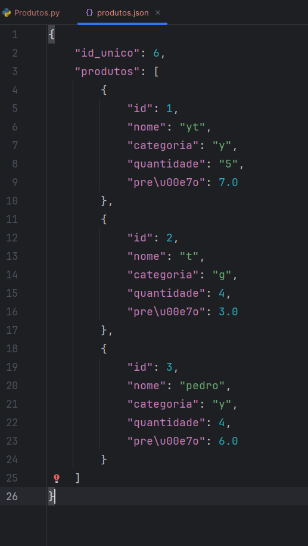

# Sistema de Gerenciamento de Inventário

Este é um sistema de gerenciamento de produtos que permite adicionar, listar, atualizar, remover e buscar produtos. Todas as interações são feitas via terminal, ele foi desenvolvido em Python e usa arquivos JSON para salvar os dados.

## Funcionalidades

### Adicionar Produto

Permite adicionar novos produtos ao inventário. Cada produto possui os seguintes campos:
- **ID**: Gerado automaticamente e único.
- **Nome**: Nome do produto.
- **Categoria**: Categoria à qual o produto pertence.
- **Quantidade**: Número de unidades disponíveis.
- **Preço**: Valor do produto.

### Listar Produtos

Exibe todos os produtos registrados no inventário. Inclui opções de filtragem e ordenação:
- Filtrar por categoria.
- Ordenar por nome, quantidade ou preço.

### Atualizar Produto

Permite modificar os campos de um produto existente (nome, quantidade, preço ou categoria).

### Remover Produto

Remove um produto do inventário com base no ID informado. Antes de remover, solicita confirmação do usuário.

### Buscar Produto

Permite encontrar produtos por ID ou nome.

### Salvar e Sair

Salva os dados em um arquivo `produtos.json` e encerra o sistema.

### Estrutura do Arquivo JSON

Os dados são salvos em um arquivo chamado produtos.json no seguinte formato:

    

### Passo a passo de como executar o sitema

1. Baixe o arquivo
2. Abra o terminal ou prompt de comando
3. Navegue até o local do arquivo
4. Execute o código
5. Verifique o resultado de entrada e saída no terminal

### Caso não reconheça o comando python

#### Passo a Passo para Configurar e Ativar um Ambiente Virtual no Python

1. Crie um Ambiente Virtual: python -m venv .venv
2. Crie em uma versão especifica: py -3.10 -m venv .venv
3. Ative o Ambiente Virtual: 
    No Windows: .venv\Scripts\activate  
    No Mac/Linux: source .venv/bin/activate
4. Verifique se o Ambiente Virtual está ativo, quando o ambiente está ativo, você verá o nome do ambiente virtual (por exemplo, .venv) no início do prompt do terminal:  (.venv) C:\seu_projeto>
